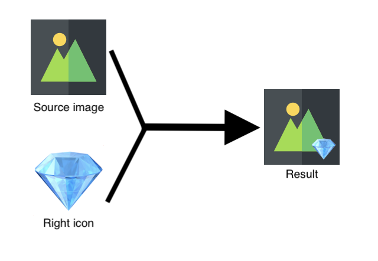
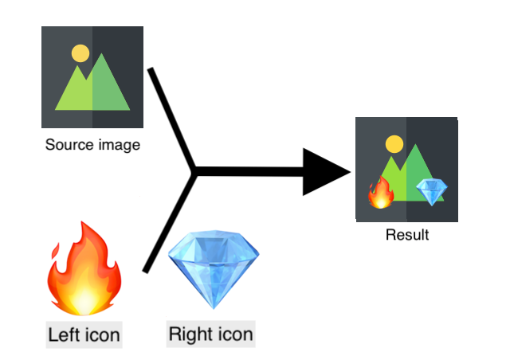
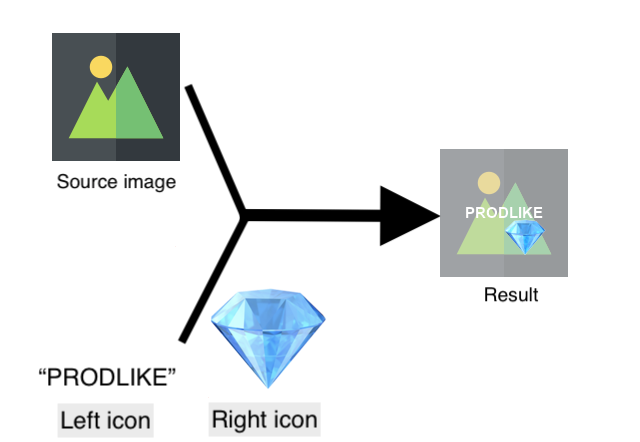

# Bitrise step - Image overlayer

This step will add icon, on the left **and/or** right bottom side of the source image.

## Usage

To give to our step the information about the expected values:
- Provide the source image's (or folder's) **path**, where we have the image or list of images on which we will add the icon(s)
  - You can provide just one image's path, the step will add icons to this one only
  - You can provide a folder's path where we many images, the step will add icons to them
- Left **and/or** right icons which will be added on the source image
  - You can provide just one image's path, the step will add it to source image
  - You can provide a text, this step will convert it to an image and add it to source image

 

At the end, it will add the icon(s) and publish the result to your artifacts

## Inputs

The asterisks (*) mean mandatory keys

|Key             |Value type                     |Description    |Default value        
|----------------|-------------|--------------|--------------|
|source_image* |String |Source image or folder path||
|left_icon |String |Left icon's path||
|right_icon |String |Right icon's path||
|output_path |String |Output file's path ||
|textcolor |String |Icon text color ||

 

## Outputs

|Key             |Value type    |Description
|----------------|-------------|--------------|
|OVERLAYED_IMAGE_PATH |String |Source image(s)' path with icon(s)|

 

## Example

Config: 
source: `assets/source.png` 
right_icon: `assets/gem.png` 

Config: 
source: `assets/source.png` 
left_icon: `assets/fire.png` 
right_icon: `assets/gem.png` 

Config: 
source: `assets/source.png` 
left_icon: `PRODLIKE` 
right_icon: `assets/gem.png` 
center_icon: `True` 
text_color: `#FFFFFF` 

 
